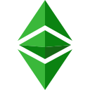
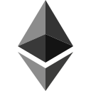

## :small_orange_diamond: alphagruis's Website

  

- https://alphagruis.github.io/
- https://alphagruis.github.io/alphagruis.html
- https://alphagruis.github.io/alphagruis-etc.html
- https://alphagruis.github.io/alphagruis-eth.html
- https://alphagruis.github.io/alphagruis-rvn.html

#### GitHub repository:
- https://github.com/alphagruis/alphagruis.github.io

## :small_orange_diamond: alphagruis's Miner for Ethereum Classic

  
  

#### GitHub repository:
- https://github.com/alphagruis/alphagruis-etc
> :small_red_triangle: *This repository is the **only** official source to download the mining software.*

## :small_orange_diamond: alphagruis's Miner for Ethereum

  
  

#### GitHub repository:
- https://github.com/alphagruis/alphagruis-eth
> :small_red_triangle: *This repository is the **only** official source to download the mining software.*

## :small_orange_diamond: alphagruis's Miner for Ravencoin

  
  

#### GitHub repository:
- https://github.com/alphagruis/alphagruis-rvn
> :small_red_triangle: *This repository is the **only** official source to download the mining software.*
